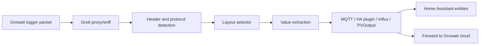

# Grott Auto Layout, Docker, and Home Assistant Add-On Design

## Purpose

This fork preserves the upstream `johanmeijer/grott` history and turns the current parser and packaging into a reliable distribution for proxy-mode Growatt telemetry, Docker, and Home Assistant. The motivating failure was not Wi-Fi or MQTT transport: two ShinePhone/Growatt dataloggers continued sending packets after the daily cutoff, but the existing parser and add-on path either dropped extended records or selected a layout that produced bogus Home Assistant entities.

The fork should solve that class of problem for other installations, not only for one household. Grott should infer a safe layout from each packet, publish only values that belong to that layout, and package the same parser for both Docker and Home Assistant add-on users.

## Goals

- Preserve the upstream Git history and make fixes suitable for upstream pull requests.
- Add automatic layout selection for Growatt packets that currently require brittle `invtype` guesses.
- Support extended `0103` records through the same generic fallback mechanism used for `0104` and `0150`.
- Avoid publishing Home Assistant discovery entities for values produced only by an implausible or wrong layout.
- Provide a single runtime image that can be used by Docker Compose and by a Home Assistant add-on.
- Keep explicit `invtype` configuration available for users who need a forced layout.
- Add packet-fixture tests so parser regressions are caught before releases.

## Non-Goals

- Do not rewrite Grott as a new project.
- Do not remove existing MQTT, InfluxDB, PVOutput, proxy, or sniff behavior.
- Do not require users to lose ShinePhone/Growatt cloud forwarding.
- Do not make the Home Assistant add-on a separate parser implementation.
- Do not change upstream copyright or licensing status without an explicit upstream-compatible license decision.

## Current Problems

### Layout Selection Is Too Rigid

Current layout selection builds a layout from the packet header and appends `invtype` when configured. If `invtype=sph`, the parser selects SPH fields even when the packet is better represented by the generic extended layout. This can create plausible-looking but wrong Home Assistant entities such as battery SOC, battery voltage, or battery type when the packet does not actually contain meaningful values at those offsets.

### Extended `0103` Records Can Be Dropped

The generic fallback currently applies to record types `04` and `50`. Captured packets showed extended `0103` records with length 585 that should be tried against generic extended layouts rather than treated as undefined.

### Home Assistant Discovery Retains Bad Entities

The HA MQTT plugin publishes retained discovery configs. When a bad layout creates extra entities, those entities remain until their retained discovery topics are cleared or superseded. This makes parser mistakes sticky and visible in the UI.

### Docker and HA Add-On Packaging Drift

The core Grott repo and the HA add-on repo are separate. The add-on packages Grott plus `grott-ha-plugin`, while Docker images may not include that plugin. Users can end up with different behavior depending on how Grott is installed.

## Upstream Issue Triage

The first implementation should fix problems that share the same root cause as the observed deployment: packets are still arriving, but layout selection, record handling, or HA discovery makes the data disappear or look wrong.

Issues in direct first-release scope:

- [#697](https://github.com/johanmeijer/grott/issues/697) reports multiple ShineWiFi loggers stopping normal telemetry around the same late-morning window while Grott still receives short command or buffered records. This supports defaulting documented proxy deployments to `time=server`, `sendbuf=False`, and command blocking, plus adding safer handling for post-cutoff record types.
- [#409](https://github.com/johanmeijer/grott/issues/409), [#676](https://github.com/johanmeijer/grott/issues/676), [#668](https://github.com/johanmeijer/grott/issues/668), and [#698](https://github.com/johanmeijer/grott/issues/698) all point at wrong or missing values when a layout family is guessed manually. These belong with candidate scoring and wrong-family rejection.
- [#711](https://github.com/johanmeijer/grott/issues/711) shows a newer 586-byte `0242` MIC packet where the cloud path still works but local parsing fails. The first release should not promise full `0242` support without fixtures, but it should make unknown layout diagnostics and external layout additions easier.
- [#702](https://github.com/johanmeijer/grott/issues/702) reports a `T06NNNNXTL3` keyword-processing failure that stops MQTT publication. Dry-run parsing and per-key parse errors should make one bad key unable to kill the whole packet.
- [#700](https://github.com/johanmeijer/grott/issues/700) is a concrete Home Assistant discovery bug caused by illegal MQTT discovery topic keys such as `pactogrids ` and `battemp `. This is safe first-release scope: sanitize discovery keys and normalize layout key names without publishing duplicate sensors.
- [#387](https://github.com/johanmeijer/grott/issues/387) and [#620](https://github.com/johanmeijer/grott/issues/620) reinforce that HA MQTT discovery needs stable unique IDs, legal topics, bounded discovery churn, and conservative retained-topic cleanup.
- [#705](https://github.com/johanmeijer/grott/issues/705), [#714](https://github.com/johanmeijer/grott/pull/714), and [#716](https://github.com/johanmeijer/grott/pull/716) support improving Docker mode/env handling and image builds as part of the fork packaging work.

Issues to keep as second-phase scope:

- [#683](https://github.com/johanmeijer/grott/issues/683), [#712](https://github.com/johanmeijer/grott/issues/712), and [#713](https://github.com/johanmeijer/grott/issues/713) focus on GrottServer command APIs and inverter registry state. They are important, but the first release should not mix command/control refactors into the telemetry parser and HA discovery fix.
- [#662](https://github.com/johanmeijer/grott/issues/662), [#677](https://github.com/johanmeijer/grott/issues/677), and related SPF/WIT support issues need device-specific fixtures before publishing confident mappings.

## HenryJanssen Fork Review

[`HenryJanssen/grott`](https://github.com/HenryJanssen/grott) is a true fork of upstream. Its `master` and `Beta-(2.8.x)` branches currently match upstream; the active work is on `Alpha`, last pushed on 2026-01-03.

Useful ideas to carry forward:

- Move layout dictionaries out of `grottconf.py` into JSON under `recorddict/`, making new layout support reviewable and testable without editing a very large Python dictionary.
- Add an `alodict/` concept for register-group based auto-layout generation. This is directionally aligned with the goal of handling new firmware layouts, including packets like issue #711.
- Track datalogger and inverter registry state in GrottServer so command APIs can resolve inverter IDs more reliably in a future phase.
- Add register metadata JSON and a conversion/import tool so known datalogger and inverter registers can be documented as data rather than scattered code.

Changes not to copy wholesale into the first release:

- The `Alpha` branch is a broad GrottServer/UI refactor with Flask, login, register pages, `waitress`, and command routing changes. That is useful second-phase material but too much blast radius for the parser/HA packaging fix.
- It commits a large `grott.log`, static site assets, a hard-coded Flask secret, and a `requires-python >=3.14` package requirement. Those should not be imported.
- The `Alpha` branch does not fix the observed `0103` fallback because `datarec` remains `["04", "50"]`.
- The copied SPA layout still contains keys with trailing spaces such as `pactogrids ` and `battemp `, so it does not solve issue #700 by itself.

First-release decision: use Henry's external-layout and register-group ideas in the plan, but implement them incrementally behind tests. Do not merge or cherry-pick the full `Alpha` branch.

## Proposed Architecture

The fork keeps Grott as the core parser and proxy. A new layout-selection layer sits between header detection and value extraction. It receives packet metadata, decrypted payload, configured preferences, and available layouts, then returns a selected layout with confidence and diagnostic reasons.

Docker and HA add-on packaging both use the same Grott source tree and the same runtime image. The HA add-on becomes a thin wrapper around the Docker image plus Supervisor configuration translation.

## Layout Selection Design

### Candidate Generation

For each packet, Grott builds a list of candidate layouts:

- exact header layout, such as `T060104X`
- generic layout, such as `T06NNNNX`
- explicit configured suffix layout, such as `T06NNNNXSPH`, when `invtype` is set
- known family layouts, such as `SPH`, `SPF`, `TL3`, `SPA`, `MIN`, and `MOD`, when matching layouts exist
- configured `invtypemap` candidate when the inverter serial is available

Record type `03` is eligible for generic fallback, matching the fallback behavior already used for `04` and `50`.

### Scoring

Each candidate is parsed in a dry-run mode. The selector scores the candidate using field plausibility and consistency:

- serial fields decode as printable ASCII and match the packet/device where available
- numeric values fit physical ranges for voltage, current, power, frequency, temperature, and energy
- cumulative energy does not jump backwards or by impossible amounts for the same device
- layout-specific fields are penalized when too many added fields are all zero while core generic fields are sensible
- Home Assistant discovery count is stable for the selected layout and does not expand only because an implausible suffix was forced
- smart meter records are excluded from inverter-family suffix scoring

The selector chooses the highest-confidence layout. If no candidate clears the minimum threshold, Grott logs the packet as unclassified and skips publishing parsed values while still forwarding in proxy mode.

### Overrides

Existing `invtype` remains supported:

- `invtype=default` means auto-select among generic and detected candidates.
- `invtype=sph`, `spf`, `tl3`, `spa`, `min`, or `mod` means prefer that family but still reject it when it fails hard plausibility checks unless `layout_strict=True`.
- `layout_strict=True` forces legacy behavior for users who depend on exact historical layouts.
- `invtypemap` continues to map known inverter serials to preferred layout families.

### Diagnostics

Verbose mode logs:

- packet header, record type, length, and buffered status
- candidate layouts tried
- selected layout and confidence
- top rejection reasons for non-selected candidates

Logs must avoid dumping credentials and should not dump full packet payloads by default.

## Home Assistant MQTT Discovery

The HA plugin should publish discovery only for keys produced by the selected layout. It should not create sensors for fields absent from the selected layout.

Discovery should include a version marker in the config payload. When the set of discovered keys shrinks because the selected layout changes, the plugin should clear retained discovery topics that were previously created by the same device and plugin version lineage. This prevents stale battery or family-specific entities from lingering after a layout correction.

The plugin should preserve existing entity IDs where the unique ID and key remain the same. Users should not lose dashboards for stable, correct sensors such as PV input, PV output, grid voltage, energy today, or Grott last push.

## Docker Packaging

The Docker image should:

- build directly from this fork
- include Python runtime dependencies used by Grott
- optionally include `grott-ha-plugin` or the in-tree HA plugin package
- expose port `5279`
- support config through `grott.ini` and environment variables
- publish multi-architecture images for common Home Assistant host architectures

The Docker Compose example should provide:

- proxy mode
- `blockcmd=True`
- `time=server`
- `sendbuf=False`
- `invtype=default`
- optional HA MQTT plugin configuration

## Home Assistant Add-On Packaging

The HA add-on should live in the same repository under an add-on directory. It should:

- use the same Docker image or Dockerfile as the Docker distribution
- expose Grott port `5279`
- translate Supervisor add-on options to Grott environment/config values
- configure the HA MQTT plugin from Supervisor MQTT service details when available
- document how to migrate from existing Grott add-ons
- avoid patching parser files at container startup

## Test Strategy

### Unit Tests

Add parser tests for:

- candidate layout generation from packet headers
- `0103` generic fallback
- dry-run parsing without publishing
- scoring and rejecting implausible layouts
- preserving explicit strict layout behavior

### Fixture Tests

Store sanitized packet fixtures for representative devices. The first fixtures should include:

- a 585-byte `T060104X` packet that selects `T06NNNNX`
- the same packet parsed against `T06NNNNXSPH`, proving SPH is rejected because it creates bogus battery fields
- a post-cutoff extended `0103` packet that falls back to a generic layout instead of being dropped
- a buffered `0150` packet that is skipped when `sendbuf=False`

Fixture tests assert both selected layout and key output. They should verify that PV fields remain correct and battery-only keys are not emitted unless the selected layout legitimately contains them.

### Integration Tests

Add tests for HA discovery payload generation:

- discovery is produced only for selected-layout keys
- keys previously published by the Grott HA plugin for the same device generate retained-empty cleanup messages when absent from the newly selected layout
- state payloads match discovery templates

Add Docker smoke tests:

- container starts in proxy mode
- config/env values are loaded
- HA plugin import works when enabled

## Migration Behavior

Existing users with `invtype=default` should see improved layout selection without config changes.

Existing users with explicit `invtype` should keep working. If the selector rejects a preferred family as implausible, Grott should log the reason and use the safer layout unless `layout_strict=True` is set.

Home Assistant users may need one-time stale discovery cleanup when moving from older add-ons. The add-on documentation should include a safe retained-topic cleanup command and explain when it is needed.

## Release Plan

The first fork release should be a beta:

- `0.1.0-beta` for the fork package/add-on release
- Docker tag based on upstream Grott version plus fork suffix
- release notes explaining auto layout selection, `0103` fallback, HA discovery cleanup, and migration from existing add-ons

After field validation, a stable release can be cut and selected patches can be proposed upstream as smaller pull requests.

## Open Risks

- Upstream has no GitHub-detected license metadata, so redistribution and packaging must preserve the existing repository terms and avoid adding a conflicting license.
- Layout plausibility scoring needs real packet diversity; overly aggressive rejection could hurt uncommon inverters.
- HA discovery cleanup must be conservative so it does not delete user-created MQTT entities outside Grott ownership.
- Some users rely on historical entity IDs from older examples or add-ons; migration docs must be explicit about which IDs remain stable.

## Success Criteria

- The fork exists as a true GitHub fork of `johanmeijer/grott`.
- The same source tree builds a Docker image and HA add-on.
- Captured packet fixtures pass layout-selection tests.
- `0103` extended records are processed when a valid generic layout exists.
- Wrong-family layouts are rejected when they produce implausible fields.
- HA discovery creates only valid selected-layout entities.
- A proxy-mode deployment continues forwarding packets to Growatt while publishing sane MQTT/HA values.
